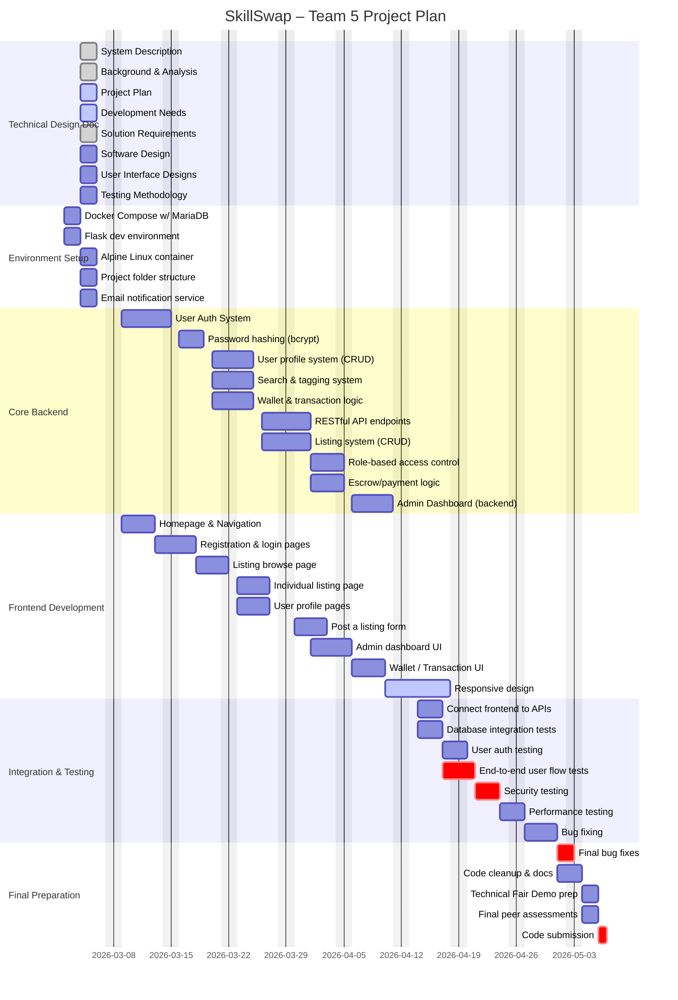

```mermaid
gantt
    title SkillSwap – Team 5 Project Plan
    dateFormat  YYYY-MM-DD
    excludes    weekends

    section Technical Design Doc
    System Description          :done,    td1, 2026-03-04, 2026-03-06
    Background & Analysis       :done,    td2, 2026-03-04, 2026-03-06
    Project Plan                :active,  td3, 2026-03-04, 2026-03-06
    Development Needs           :active,  td4, 2026-03-04, 2026-03-06
    Solution Requirements       :done,    td5, 2026-03-04, 2026-03-06
    Software Design             :         td6, 2026-03-04, 2026-03-06
    User Interface Designs      :         td7, 2026-03-04, 2026-03-06
    Testing Methodology         :         td8, 2026-03-04, 2026-03-06

    section Environment Setup
    Docker Compose w/ MariaDB   :         es1, 2026-03-02, 2026-03-04
    Flask dev environment       :         es2, 2026-03-02, 2026-03-04
    Alpine Linux container      :         es3, 2026-03-04, 2026-03-06
    Project folder structure    :         es4, 2026-03-04, 2026-03-06
    Email notification service  :         es5, 2026-03-04, 2026-03-06

    section Core Backend
    User Auth System            :         be1, 2026-03-09, 2026-03-15
    Password hashing (bcrypt)   :         be2, 2026-03-16, 2026-03-19
    User profile system (CRUD)  :         be3, 2026-03-20, 2026-03-25
    Search & tagging system     :         be4, 2026-03-20, 2026-03-25
    Wallet & transaction logic  :         be5, 2026-03-20, 2026-03-25
    RESTful API endpoints       :         be6, 2026-03-26, 2026-04-01
    Listing system (CRUD)       :         be7, 2026-03-26, 2026-04-01
    Role-based access control   :         be8, 2026-04-01, 2026-04-05
    Escrow/payment logic        :         be9, 2026-04-01, 2026-04-05
    Admin Dashboard (backend)   :         be10, 2026-04-06, 2026-04-11

    section Frontend Development
   Homepage & Navigation       :         fe1, 2026-03-09, 2026-03-13
    Registration & login pages  :         fe2, 2026-03-13, 2026-03-18
    Listing browse page         :         fe3, 2026-03-18, 2026-03-22
    Individual listing page     :         fe4, 2026-03-23, 2026-03-27
    User profile pages          :         fe5, 2026-03-23, 2026-03-27
    Post a listing form         :         fe6, 2026-03-30, 2026-04-03
    Admin dashboard UI          :         fe7, 2026-04-01, 2026-04-06
    Wallet / Transaction UI     :         fe8, 2026-04-06, 2026-04-10
    Responsive design           :active,  fe9, 2026-04-10, 2026-04-18

    section Integration & Testing
    Connect frontend to APIs    :         it1, 2026-04-14, 2026-04-17
    Database integration tests  :         it2, 2026-04-14, 2026-04-17
    User auth testing           :         it3, 2026-04-17, 2026-04-20
    End-to-end user flow tests  :crit,    it4, 2026-04-17, 2026-04-21
    Security testing            :crit,    it5, 2026-04-21, 2026-04-24
    Performance testing         :         it6, 2026-04-24, 2026-04-27
    Bug fixing                  :         it7, 2026-04-27, 2026-05-01

    section Final Preparation
    Final bug fixes             :crit,    fp1, 2026-05-01, 2026-05-03
    Code cleanup & docs         :         fp2, 2026-05-01, 2026-05-04
    Technical Fair Demo prep    :         fp3, 2026-05-04, 2026-05-06
    Final peer assessments      :         fp4, 2026-05-04, 2026-05-06
    Code submission             :crit,    fp5, 2026-05-06, 2026-05-07
```
