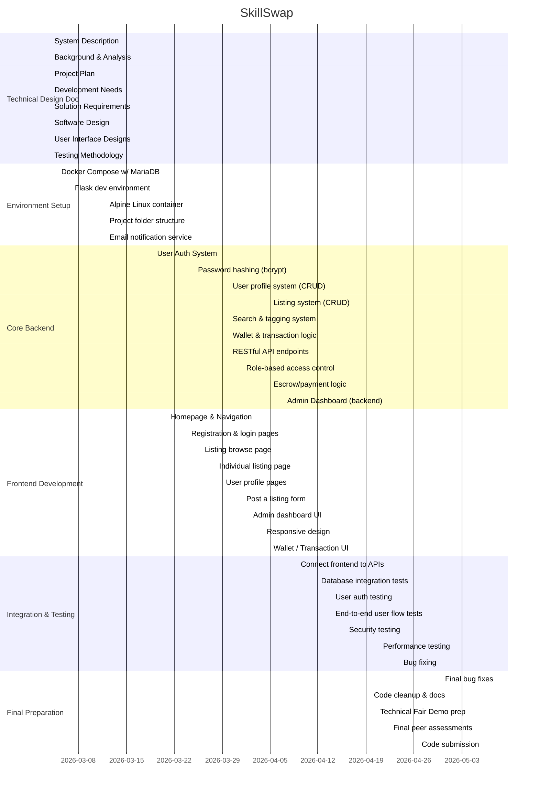

```mermaid
gantt
    title SkillSwap
    dateFormat  DD-MM-YYYY

    section Technical Design Doc
    System Description          :done,    td1, 2026-03-04, 2026-03-06
    Background & Analysis       :done,    td2, 2026-03-04, 2026-03-06
    Project Plan                :active,  td3, 2026-03-04, 2026-03-06
    Development Needs           :active,  td4, 2026-03-04, 2026-03-06
    Solution Requirements       :done,    td5, 2026-03-04, 2026-03-06
    Software Design             :         td6, 2026-03-04, 2026-03-06
    User Interface Designs      :         td7, 2026-03-04, 2026-03-06
    Testing Methodology         :         td8, 2026-03-04, 2026-03-06

    section Environment Setup
    Docker Compose w/ MariaDB   :         es1, 2026-03-05, 2026-03-09
    Flask dev environment       :         es2, 2026-03-07, 2026-03-12
    Alpine Linux container      :         es3, 2026-03-12, 2026-03-15
    Project folder structure    :         es4, 2026-03-12, 2026-03-14
    Email notification service  :         es5, 2026-03-12, 2026-03-15

    section Core Backend
    User Auth System            :         be1, 2026-03-19, 2026-03-24
    Password hashing (bcrypt)   :         be2, 2026-03-25, 2026-03-29
    User profile system (CRUD)  :         be3, 2026-03-30, 2026-04-04
    Listing system (CRUD)       :         be4, 2026-04-05, 2026-04-09
    Search & tagging system     :         be5, 2026-03-30, 2026-04-03
    Wallet & transaction logic  :         be6, 2026-03-30, 2026-04-03
    RESTful API endpoints       :         be7, 2026-03-30, 2026-04-03
    Role-based access control   :         be8, 2026-04-01, 2026-04-05
    Escrow/payment logic        :         be9, 2026-04-05, 2026-04-09
    Admin Dashboard (backend)   :         be10, 2026-04-07, 2026-04-11

    section Frontend Development
    Homepage & Navigation       :         fe1, 2026-03-21, 2026-03-24
    Registration & login pages  :         fe2, 2026-03-24, 2026-03-28
    Listing browse page         :         fe3, 2026-03-26, 2026-03-29
    Individual listing page     :         fe4, 2026-03-28, 2026-04-02
    User profile pages          :         fe5, 2026-03-29, 2026-04-01
    Post a listing form         :         fe6, 2026-04-01, 2026-04-05
    Admin dashboard UI          :         fe7, 2026-04-02, 2026-04-07
    Responsive design           :active,  fe8, 2026-04-04, 2026-04-09
    Wallet / Transaction UI     :         fe9, 2026-04-05, 2026-04-10

    section Integration & Testing
    Connect frontend to APIs    :         it1, 2026-04-09, 2026-04-12
    Database integration tests  :         it2, 2026-04-12, 2026-04-16
    User auth testing           :         it3, 2026-04-14, 2026-04-17
    End-to-end user flow tests  :crit,    it4, 2026-04-14, 2026-04-18
    Security testing            :crit,    it5, 2026-04-16, 2026-04-21
    Performance testing         :         it6, 2026-04-21, 2026-04-24
    Bug fixing                  :         it7, 2026-04-24, 2026-04-29

    section Final Preparation
    Final bug fixes             :crit,    fp1, 2026-04-30, 2026-05-02
    Code cleanup & docs         :         fp2, 2026-05-01, 2026-05-04
    Technical Fair Demo prep    :         fp3, 2026-05-04, 2026-05-06
    Final peer assessments      :         fp4, 2026-05-05, 2026-05-06
    Code submission             :crit,    fp5, 2026-05-06, 2026-05-07
```
